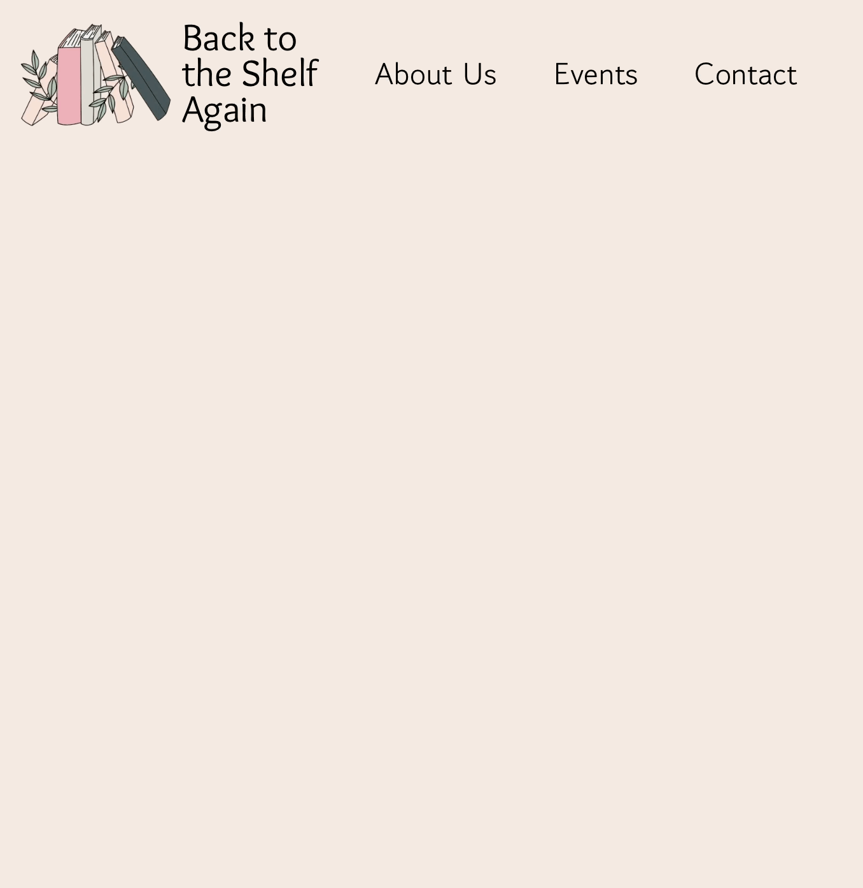
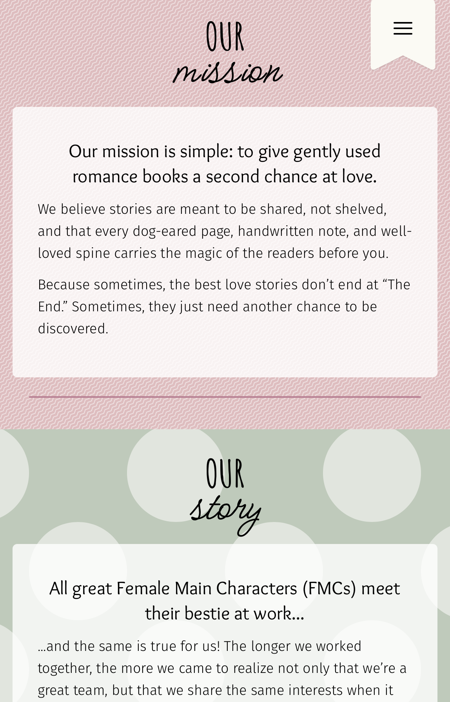
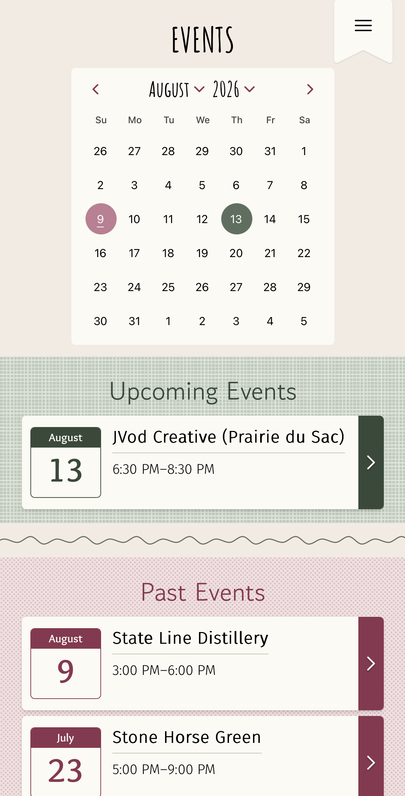
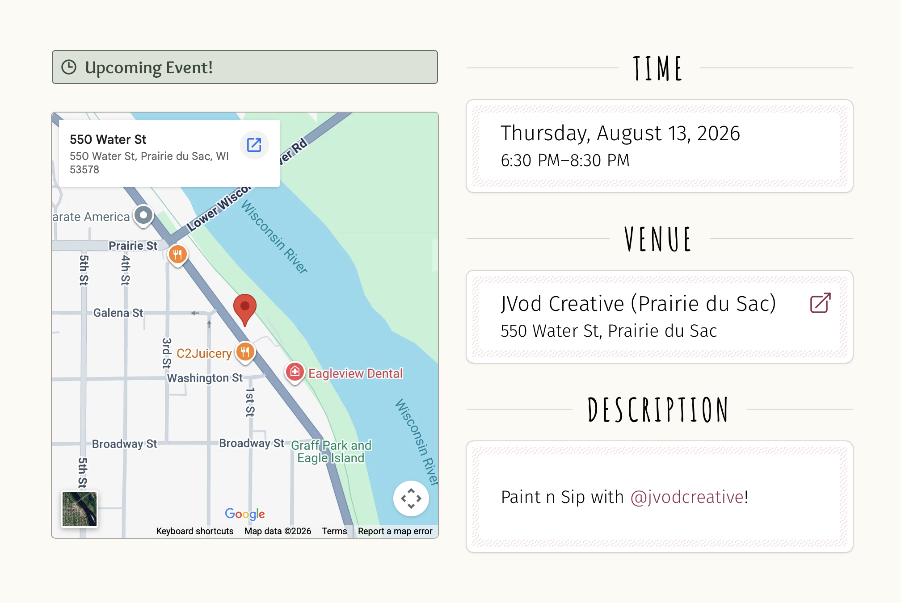
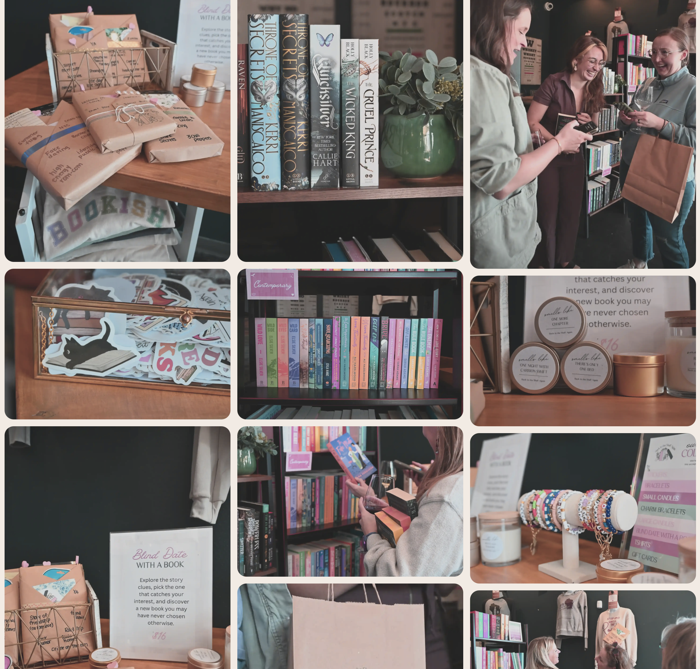

# Back to the Shelf Again

A full-stack site for **Back to the Shelf Again**, a pop-up book shop based in South-Central Wisconsin selling gently-used romance books at local vendor markets and events. Built with Next.js and Payload CMS, it gives non-developer admins an easy way to manage upcoming events and the reusable locations they're held at.

## Features

- 📚 Public-facing site for browsing upcoming pop-up shop events
- 🔐 Admin login for non-technical staff via Payload CMS
- 📅 Event management with date pickers, linked to reusable venue/location records
- 📍 Locations as a separate, reusable collection (no re-entering the same address every time)
- 🎨 Styled with Tailwind CSS v4 and animated with Motion
- 🧪 End-to-end tests with Playwright

## Screenshots

## Tech Stack

| Layer | Technology |
|---|---|
| Framework | [Next.js](https://nextjs.org/) 16 (React 19) |
| CMS / Admin | [Payload CMS](https://payloadcms.com/) 3 |
| Database | PostgreSQL (via `@payloadcms/db-postgres` / `@payloadcms/db-vercel-postgres`) |
| Rich Text | Payload Lexical editor |
| Styling | Tailwind CSS v4, `clsx`, `tailwind-merge` |
| Icons | Heroicons |
| Animation | Motion |
| Date Picker | `react-day-picker` |
| Testing | Playwright |
| Language | TypeScript |

## Content Model

- **Events** — upcoming pop-up shop appearances (date, description, related location)
- **Locations** — reusable vendor/venue records that events link to, so the same market or shop only needs to be entered once

## Testing

End-to-end tests are written with Playwright.
